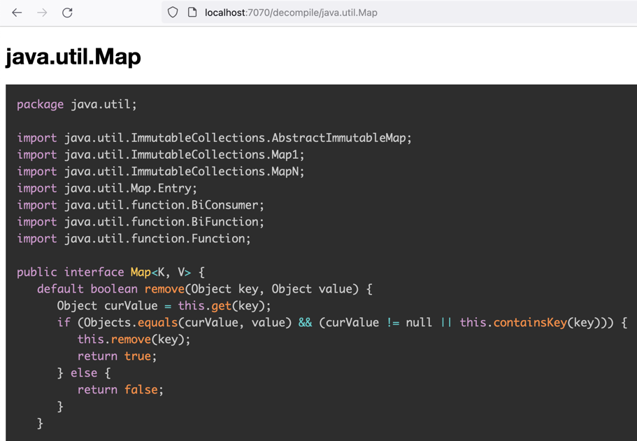

Classviewer
===========

Ever wondered how your classes actually look like at run-time?

This project, written as a Java 21 agent, gives you a simple to use web-interface 
to explore the classes loaded by your JVM.

Just build the project with `mvn package` and run your Java program with the agent:

```shell
java -javaagent:target/classviewer.jar -jar your-program.jar
# or with a specific port, by default it uses 7070
java -javaagent:target/classviewer.jar=port=8080 -jar your-program.jar
# or for the Loop.java example
java -javaagent:target/classviewer.jar Loop.java
```

Then open your browser at `http://localhost:7070` (or your port) and
you will see a list of available commands.

Currently available commands are:
- `/` or `/help` 
- `/list` to list all classes
- `/list/pattern`: to list all classes matching the glob-like pattern
  - `.` and `$` are escaped, `*` is replaced by `.*`
- `/decompile/class name or pattern`: to decompile a class or classes matching the pattern



Contributions
-------------
If you have sample programs where this tool helped to see something interesting, please share.
Contributions, issues and PRs are welcome.

License
-------
MIT License